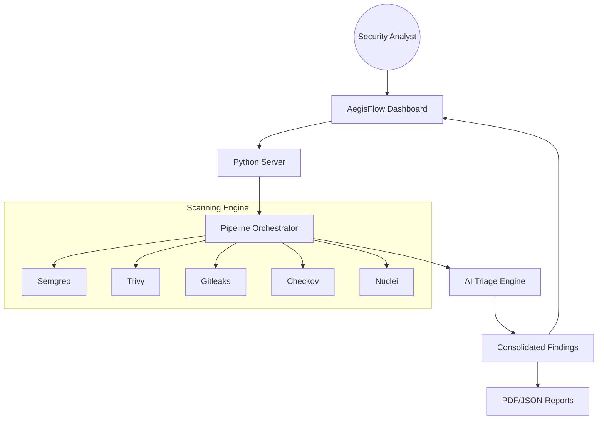

# 🛡️ AegisFlow: Autonomous Enterprise ASPM & DevSecOps Orchestrator

[](https://semgrep.dev/)
[](https://aquasecurity.github.io/trivy/)
[](https://github.com/gitleaks/gitleaks)
[](https://groq.com/)

**AegisFlow** is a next-generation Application Security Posture Management (ASPM) platform designed to unify SAST, SCA, DAST, Secrets, and IaC scanning into a single, autonomous pipeline. Featuring a modern glassmorphism dashboard and an AI-driven triage engine, it transforms raw security data into actionable executive insights.

---

## 🏗️ System Architecture



---

## ✨ Key Features

- **🚀 Autonomous Pipeline**: One-click execution of 5+ industry-standard security scanners.
- **🧠 AI Triage Hub**: Intelligent vulnerability classification using LLMs (Llama-3.3) to reduce false positives.
- **💎 Premium Dashboard**: High-fidelity Glassmorphism UI with real-time telemetry and 1:1 navigation-to-panel mapping.
- **📄 Executive Report Center**: Professional PDF/HTML report generation with security scoring and remediation roadmaps.
- **🔍 Multi-Layer Analysis**: Integrated support for Source Code, Dependencies, Secrets, Cloud Infrastructure, and Dynamic Runtime.

---

## 🛠️ Security Toolchain

AegisFlow integrates the industry's best-in-class open-source security tools:

| Category | Tool | Description |
| :--- | :--- | :--- |
| **SAST** | `Semgrep` | Semantic analysis for vulnerability patterns. |
| **SCA** | `Trivy` | Software Composition Analysis for vulnerable dependencies. |
| **Secrets** | `Gitleaks` | High-accuracy detection of leaked API keys and credentials. |
| **IaC** | `Checkov` | Misconfiguration scanning for Docker, K8s, and Terraform. |
| **DAST** | `Nuclei` | Dynamic template-based scanning for live targets. |
| **AI** | `Groq/Llama-3` | Context-aware triage and automated remediation guidance. |

---

## 🚀 Quick Start

### 1. Prerequisites
- Docker & Docker Compose
- (Optional) [Groq API Key](https://console.groq.com/) for AI-powered triage.

### 2. Launch the Platform
```bash
# Clone the repository
git clone https://github.com/luonglt20/AegisFlow.git
cd AegisFlow

# Start the environment
docker-compose up --build
```

### 3. Access the Dashboard
Navigate to `http://localhost:58081` to launch your first security scan.

---

## 📂 Repository Structure

- `dashboard/`: Premium Frontend & Backend server logic.
- `pipeline/`: Core security bridge scripts and orchestrator.
- `docs/`: Comprehensive technical documentation and user guides.
- `demo-targets/`: Consolidated directory containing vulnerable-app and real-world targets for validation.
- `tests/`: End-to-end security test suites.

---

## 🛡️ License & Safety

This project is built for professional security demonstration purposes. Ensure all DAST targets are explicitly authorized before scanning. 

&copy; 2026 AegisFlow Enterprise. All rights reserved.
