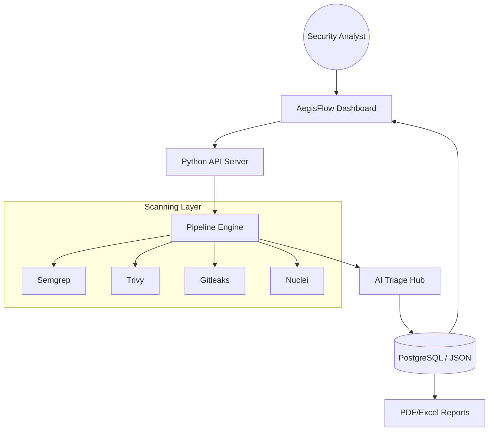

<p align="center">
  
</p>

<h1 align="center">🛡️ AegisFlow</h1>
<p align="center">
  <strong>Autonomous Enterprise ASPM & AI-Powered DevSecOps Orchestrator</strong>
</p>

<p align="center">
  
  
  
  
</p>

---

## 🌟 Overview

**AegisFlow** is a next-generation **Application Security Posture Management (ASPM)** platform designed to simplify complex security workflows. It unifies high-fidelity scanning tools (SAST, SCA, DAST, Secrets, IaC) into a single, autonomous pipeline, visualized through a stunning premium dashboard.

Built for the modern security engineer, AegisFlow doesn't just find vulnerabilities—it uses **AI-driven triage** to classify findings and provide automated remediation guidance, reducing MTTR (Mean Time To Remediate) by up to 70%.

---

## ✨ Core Pillars

### 🚀 1. Autonomous Pipeline Orchestration
One-click execution of the industry's best-in-class security toolchain:
- **SAST**: `Semgrep` for deep semantic code analysis.
- **SCA**: `Trivy` for dependency and vulnerability detection.
- **Secrets**: `Gitleaks` for high-accuracy credential hunting.
- **IaC**: `Checkov` for infrastructure misconfiguration (K8s, Terraform, Docker).
- **DAST**: `Nuclei` for intelligent runtime vulnerability probing.

### 🧠 2. AI Triage Engine (Groq/Llama-3)
Eliminate manual triage fatigue. AegisFlow integrates an LLM-powered engine that:
- **Auto-Classifies**: Context-aware True Positive vs. False Positive detection.
- **Business Impact**: Evaluates risk based on application criticality.
- **AI Remediation**: Provides drop-in code fixes and hardening suggestions.

### 💎 3. Premium Glassmorphism Dashboard
A state-of-the-art UI experience designed for clarity and impact:
- **Real-time Telemetry**: Watch the pipeline work with interactive status animations.
- **Executive Overview**: KPI-driven insights for C-level reporting.
- **Security Scoring**: Instant health metrics based on vulnerability density and SLA.

---

## 🏗️ System Architecture



---

## 🚀 Quick Start (Production Mode)

Ensure you have **Docker Desktop** installed, then run:

```bash
# 1. Clone & Enter
git clone https://github.com/luonglt20/AegisFlow.git && cd AegisFlow

# 2. Launch (One Command)
./run_mac.sh
```

> **Note**: For AI-powered triage, add your `GROQ_API_KEY` to the `.env` file or input it directly in the Dashboard.

---

## 📂 Repository Layout

- `dashboard/`: Premium React-style Vanilla JS frontend & API layer.
- `pipeline/`: The "Brain" of the scanning and AI integration.
- `demo-targets/`: Curated vulnerable applications (NodeGoat, PyGoat, WebGoat).
- `docs/`: Technical threat models, API specs, and compliance mappings.
- `assets/`: Project visual identity and hero banners.

---

## 🛡️ Roadmap & Safety

- [x] Multi-language support (Java, Python, JS).
- [x] Real-time WebSocket-like UI polling.
- [x] AI-Powered Remediation Plans.
- [ ] **Coming Soon**: Multi-tenant RBAC support.
- [ ] **Coming Soon**: Jira & Slack Integration.

**Safety First**: AegisFlow is a powerful security tool. Only scan targets you are authorized to test.

---

<p align="center">
  Developed with ❤️ for the DevSecOps Community.<br>
  &copy; 2026 <strong>AegisFlow Enterprise</strong>
</p>
